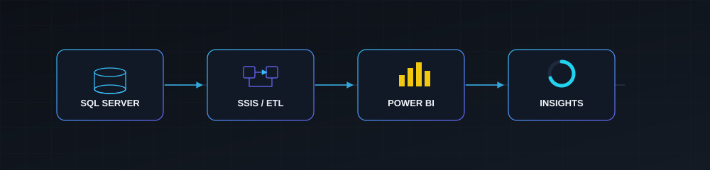

<div align="center">

</div>

<br>

<div align="center">

<sub>ANJINAYYA NAYAK</sub>

# Data Analyst · SQL Developer · Power BI Developer

Turning raw data into reliable queries, meaningful dashboards, and actionable insights.

<a href="https://www.linkedin.com/in/anjinayya-nayak-0936a5340/"></a>
<a href="https://anjinayya-nayak-ri4qmiw.gamma.site/"></a>
<a href="https://www.hackerrank.com/profile/AnjinayyaNayak"></a>
<a href="mailto:anjineynyk@gmail.com"></a>

</div>

<br>

<div align="center">

`SQL` &nbsp;→&nbsp; `ETL` &nbsp;→&nbsp; `DATABRICKS` &nbsp;→&nbsp; `POWER BI` &nbsp;→&nbsp; `INSIGHTS`

</div>


### About

<table>
<tr>
<td width="60%" valign="top">

Data professional focused on **SQL Server, T-SQL, and Power BI**, with hands-on work in data extraction, cleansing, validation, and reporting. I write SQL that holds up — joins, window functions, CTEs, stored procedures — and turn it into dashboards people actually use to make decisions.

<sub>📍 Bengaluru, Karnataka &nbsp;·&nbsp; 🎓 M.Sc. Computer Science &nbsp;·&nbsp; 💼 Open to opportunities</sub>

</td>
<td width="40%" valign="top">

**Focus**

```
SQL Server / T-SQL
      │
   Power BI / DAX
      │
    ETL / SSIS
      │
   Databricks
      │
     Python
```

</td>
</tr>
</table>


### Experience

**Junior Developer** — Tackle-D Solutions Pvt Ltd &nbsp;·&nbsp; `Apr 2024 – Nov 2024`
Improved application performance by 30% through code optimization; supported migration of legacy web applications, contributing to a 25% improvement in system reliability.

**Data Intern** — CDAC &nbsp;·&nbsp; `Aug 2023 – Feb 2024`
Wrote and optimized T-SQL queries in SQL Server for data extraction, transformation, and reporting; worked with stored procedures and supported data pipeline tasks.


### Core Skills

<table>
<tr>
<td width="33%" valign="top">

**SQL & Database**

`SQL Server` `T-SQL` `Joins` `CTEs` `Window Functions` `Stored Procedures` `Views` `Functions` `Triggers` `Indexes` `Query Optimization` `Data Warehousing`

</td>
<td width="33%" valign="top">

**Power BI**

`Power BI` `DAX` `Power Query` `Data Modeling` `Star Schema` `Snowflake Schema` `KPI Dashboards` `Drill-Through` `Row-Level Security`

</td>
<td width="33%" valign="top">

**ETL**

`SSIS` `ETL` `Data Transformation` `Data Cleaning` `Data Validation` `Staging` `Incremental Load` `Lookup` `Derived Column` `Conditional Split`

</td>
</tr>
<tr>
<td width="33%" valign="top">

**Modern Data Platform**

`Databricks SQL` `Databricks` `Lakehouse` `Medallion Architecture` `Apache Spark`

</td>
<td width="33%" valign="top">

**Analytics & Scripting**

`Python` `Pandas` `NumPy` `Excel`

</td>
<td width="33%" valign="top">

**Tools**

`SSMS` `Visual Studio` `Git` `GitHub`

</td>
</tr>
</table>


### Data Stack

<div align="center">

**SOURCES** `SQL Server` `MySQL` `Excel`
&nbsp;↓&nbsp;
**TRANSFORM** `T-SQL` `SSIS` `ETL`
&nbsp;↓&nbsp;
**PLATFORM** `Databricks SQL` `Lakehouse`
&nbsp;↓&nbsp;
**BI** `Power BI` `DAX` `Tableau`
&nbsp;↓&nbsp;
**OUTPUT** `Dashboards` `KPIs` `Reporting`

</div>




### Featured Projects

<table>
<tr>
<td width="100%" valign="top">

**🏦 Bank Customer Churn Analysis** — Featured
`SQL Server` `T-SQL` `Power BI` `DAX`

Problem → Predict which banking customers are likely to churn.
Solution → SQL Server schema + T-SQL cleaning/segmentation on 10,000+ records, Power BI dashboard with DAX churn/retention measures.
Insight → Ages 45–60 with credit score < 500 are highest-risk; Germany's churn rate is 2× France/Spain.

</td>
</tr>
</table>

<table>
<tr>
<td width="50%" valign="top">

**📈 Sales Performance Dashboard**
`Looker Studio`
Problem → Stakeholders needed live sales visibility.
Solution → Real-time dashboard tied to Google Sheets.
Insight → Reporting efficiency improved 50%.

</td>
<td width="50%" valign="top">

**👥 HR Analytics Dashboard**
`Tableau`
Problem → HR needed a single workforce view.
Solution → Dashboard covering headcount, roles, diversity, leave.
Insight → Enabled data-driven workforce planning.

</td>
</tr>
<tr>
<td width="50%" valign="top">

**🎬 Netflix Data Insights**
`Tableau`
Problem → Understand global content trends.
Solution → Cleaned & visualized genre/country/date data.
Insight → Content patterns across 190+ countries.

</td>
<td width="50%" valign="top">

**🛒 Amazon Product Sales Report**
`Looker Studio`
Problem → Sales needed clear category/location KPIs.
Solution → Interactive dashboard with geo + trend views.
Insight → Ready-to-use KPIs for sales reviews.

</td>
</tr>
<tr>
<td width="50%" valign="top">

**🗳️ Bihar 2025 Election Analytics**
`Power BI`
Problem → Break down turnout & party performance.
Solution → Regional/demographic Power BI dashboard.
Insight → 200+ constituency-level results visualized.

</td>
<td width="50%" valign="top">

**🏏 Cricket Career Insights**
`Power BI`
Problem → Visualize a player's career arc.
Solution → Runs/matches/milestones dashboard.
Insight → Career trends across multiple seasons.

</td>
</tr>
</table>


### Featured Certifications

<table>
<tr>
<td width="25%" align="center">

**SQL Analytics & BI**
on Databricks
<sub>Databricks Academy</sub>

</td>
<td width="25%" align="center">

**Databricks**
Fundamentals
<sub>Databricks Academy</sub>

</td>
<td width="25%" align="center">

**Generative AI**
Fundamentals
<sub>Databricks Academy</sub>

</td>
<td width="25%" align="center">

**SQL**
(Advanced)
<sub>HackerRank</sub>

</td>
</tr>
<tr>
<td width="25%" align="center">

**Data**
Fundamentals
<sub>IBM</sub>

</td>
<td width="25%" align="center">

**Data Analytics**
Essentials
<sub>Cisco</sub>

</td>
<td width="25%" align="center">

**Python for**
Data Science
<sub>IBM</sub>

</td>
<td width="25%" align="center">

</td>
</tr>
</table>

<details>
<summary><b>Other Credentials</b></summary>
<br>

- Azure & AWS Databricks Platform Architect — Databricks Academy
- SQL & Relational Database — IBM
- Artificial Intelligence Fundamentals — IBM
- Tableau Fundamentals & Dashboards — Tableau
- Data Visualisation using Python — Infosys Springboard
- Business Analyst — Unqork
- Google Analytics Certification — Google Skillshop
- Data Science & Analytics — HP LIFE
- Data Analytics Job Simulation — Deloitte Australia
- Developer & Technology Job Simulation — Accenture UK

</details>


### GitHub Activity

<div align="center">


</div>


<div align="center">

### Let's build something with data.

Open to opportunities in **Data Analytics · SQL Development · Power BI / BI Development**

<a href="https://www.linkedin.com/in/anjinayya-nayak-0936a5340/"></a>
<a href="https://anjinayya-nayak-ri4qmiw.gamma.site/"></a>
<a href="https://www.hackerrank.com/profile/AnjinayyaNayak"></a>
<a href="mailto:anjineynyk@gmail.com"></a>


</div>
