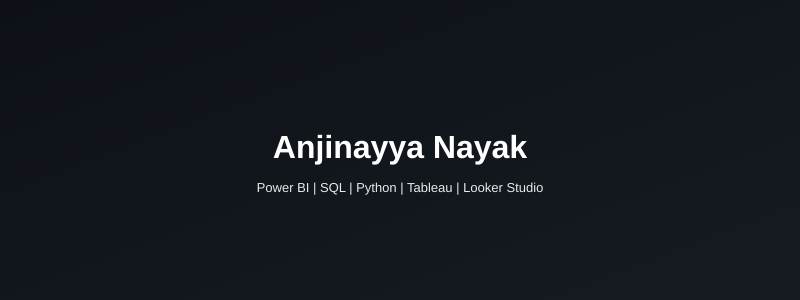

  
  
  
  

---

## 👨‍💼 About Me

| 📍 Bengaluru, Karnataka | 🎓 M.Sc. Computer Science | 💼 Open to Opportunities |
|:---:|:---:|:---:|
| Gulbarga University | Class of 2022 | Full-time / Internship |

 

*"I don't just analyze data — I translate it into decisions that matter."*

 

| 🎯 Expertise | 🛠️ Core Skills | 🌱 Exploring |
|:---|:---|:---|
| Business Intelligence & Reporting | Power BI · Tableau · Looker Studio | Generative AI for Analytics |
| Data Cleaning & Transformation | SQL · Python · Pandas | Databricks & Cloud Platforms |
| KPI Dashboards & Visual Storytelling | Excel · NumPy · Matplotlib | Advanced Data Engineering |

---

## 🛠️ Tech Stack

**🗄️ Databases & Querying**

**📊 BI & Visualization**

**🐍 Programming & Libraries**

**🧰 Tools & Productivity**

---

## 📊 Featured Projects

<table>
  <tr>
    <td width="50%" valign="top">
      <h3>🏦 Bank Customer Churn Analysis</h3>
      
      
Analyzed churn behavior using geography, tenure, balance & credit score. Built interactive KPI dashboards with drill-down insights to identify key retention drivers.

      <b>📌 Key Impact:</b> Identified top churn segments with actionable recommendations
    </td>
    <td width="50%" valign="top">
      <h3>🎬 Netflix Data Insights</h3>
      
      
Explored global content trends across genres, countries & release timelines. Focused on data cleaning, date handling & visual storytelling.

      <b>📌 Key Impact:</b> Revealed content distribution patterns across 190+ countries
    </td>
  </tr>
  <tr>
    <td width="50%" valign="top">
      <h3>📈 Sales Performance Dashboard</h3>
      
      
Live sales tracking with revenue, margin & product KPIs. Integrated Google Sheets for real-time updates.

      <b>📌 Key Impact:</b> Improved reporting efficiency by <b>50%</b>
    </td>
    <td width="50%" valign="top">
      <h3>👥 HR Analytics Dashboard</h3>
      
      
Workforce analytics covering headcount, job roles, gender diversity & leave trends with interactive filters for HR decision-making.

      <b>📌 Key Impact:</b> Enabled data-driven workforce planning
    </td>
  </tr>
  <tr>
    <td width="50%" valign="top">
      <h3>🗳️ Bihar 2025 Election Analytics</h3>
      
      
Analyzed voter turnout, party performance & regional trends. Created election insights dashboards for demographic analysis.

      <b>📌 Key Impact:</b> Visualized 200+ constituency-level results
    </td>
    <td width="50%" valign="top">
      <h3>🛒 Amazon Product Sales Report</h3>
      
      
Interactive dashboard analyzing Amazon sales by order status, category & customer location with geographic & trend visualizations.

      <b>📌 Key Impact:</b> Clear KPIs for stakeholder sales review
    </td>
  </tr>
  <tr>
    <td width="50%" valign="top">
      <h3>🏏 Cricket Career Insights</h3>
      
      
Visualized player performance metrics — runs, matches, centuries & career milestones with opponent-wise comparative analysis.

      <b>📌 Key Impact:</b> Career trend analysis across multiple seasons
    </td>
    <td width="50%" valign="top">
      <h3>🏷️ More Projects Coming Soon...</h3>
      
      
Currently working on advanced analytics projects involving <b>Databricks, Python, and cloud BI platforms</b>.

      <b>📌 Stay tuned for updates!</b>
    </td>
  </tr>
</table>

---

## 🏆 Certifications

| | |
|---|---|
| 🥇 **Google Analytics Certification** – Google Skillshop | 🥇 **AI/BI for Data Analysts** – Databricks Academy |
| 🥇 **Azure & AWS Databricks Platform Architect** – Databricks | 🥇 **Generative AI Fundamentals** – Databricks Academy |
| 🥇 **Python for Data Science** – IBM | 🥇 **SQL Analytics & BI on Databricks** – Databricks Academy |
| 🥇 **SQL (Advanced)** – HackerRank | 🥇 **Data Fundamentals** – IBM |
| 🥇 **Tableau Fundamentals & Dashboards** – Tableau | 🥇 **Data Analytics Essentials** – Cisco Networking Academy |
| 🥇 **Data Analytics Job Simulation** – Deloitte Australia | 🥇 **Developer & Technology Job Simulation** – Accenture UK |
| 🥇 **Artificial Intelligence Fundamentals** – IBM | 🥇 **Data Visualisation using Python** – Infosys Springboard |
| 🥇 **Business Analyst** – Unqork | 🥇 **Databricks Fundamentals** – Databricks Academy |

---

## 🏅 Badges

| | | | |
|:---:|:---:|:---:|:---:|
|  |  |  |  |
|  |  |  |  |
|  |  | | |

---

## 📈 GitHub Stats

---

